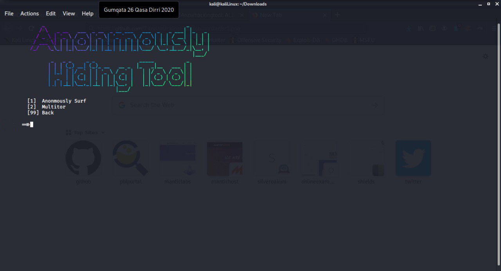
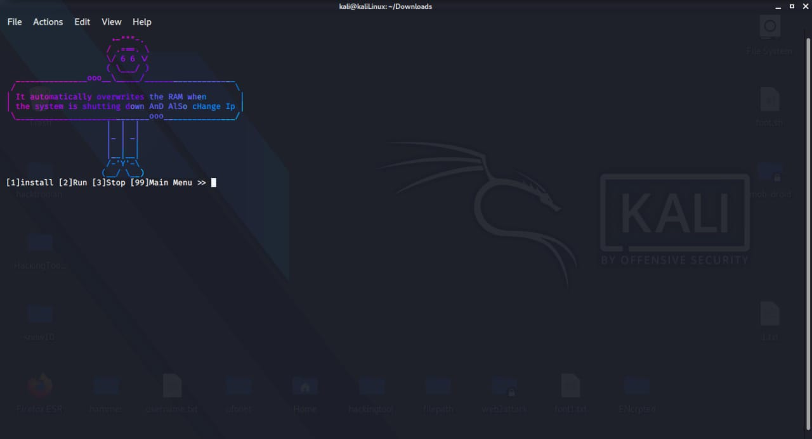

### All in One Hacking tool For Hackers🥇

#### How to run the Kali Linux CLI on Windows 10 without running a VM [YOUTUBE](https://youtu.be/BsFhpIDcd9I)

## Update available V1.1.0 🚀 
- [x] Added New Tools 
    - [x] Reverse Engineering
    - [x] RAT Tools
    - [x] Web Crawling 
    - [x] Payload Injector
- [x] Multitor Tools update
- [X] Added Tool in Wifi-Jamming

# Hackingtool Menu 🧰

   
   
   
   
   

## Installation guide for Linux 

#### THIS TOOL MUST BE RUN AS ROOT !!! run these following commands below ONE AT A TIME 

    git clone https://github.com/revanmalang/hackingtool.git
    
    chmod -R 755 hackingtool  
    
    cd hackingtool
    
    sudo pip3 install -r requirement.txt
    
    bash install.sh
    
    sudo hackingtool

After all steps are completed, run the following command ---> **root@kaliLinux:~** **hackingtool**

#### Thanks to original Author of the tools used in hackingtool

<h4>Please Don't Use for illegal Activity</h4>

### To do 
- [ ] Fully release tool 
- [ ] Add Tools for CTF
- [ ] Want to do automatic 

## Social Media :mailbox_with_no_mail:

##### If you favorite tool is not included, or you have any suggestions, please [CLICK HERE](https://forms.gle/b235JoCKyUq5iM3t8)

#### Don't forget to share this tool with your friends!
#### Thank you!!!
